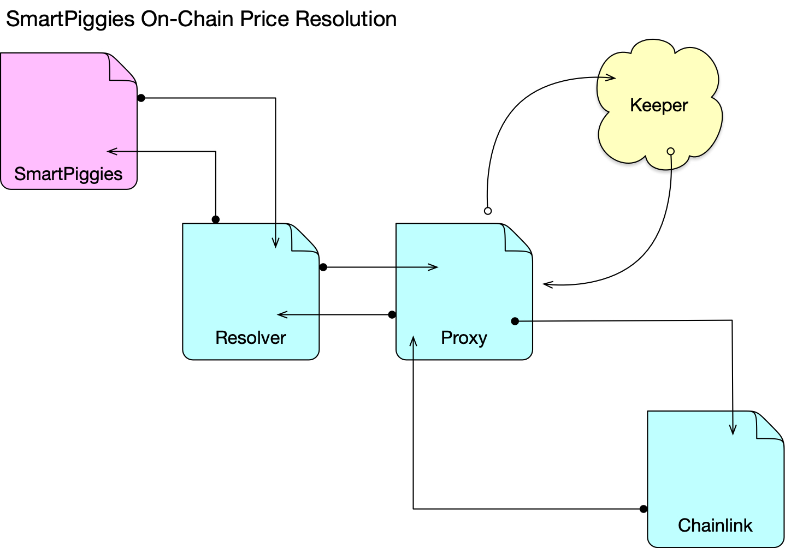

# EthDenver2022 Live Event Submission
## Chainlink Keeper Oracle Implementation

The aim of this project is to solve price settlement locking for long dated bilateral risk transfer agreements. The project provides an interface to launch oracle resolvers that interoperate with the Chainlink Keepers network to schedule price reconciliation for future dated bilateral risk transfer agreements, which execute similar to traditional financial options, where by guaranteeing price resolution upon the maturity of the agreement. In this way, spot price information can be used to settle agreements between counterparties in a trustless way, and lock the settlement price to the expiration timestamp.

*Problem*:

When a new piggy is created, how can a settlement price be locked to the expiry date of the piggy? Ideally we would like access to historical price data, which is currently too expensive (and cumbersome) to access.

How can piggies that are expired, and then settled, settle on a reference price that was observed at the time of maturity, while allowing the holder of the piggy to execute at any time prior to expiry?

*Solution*:

If the price resolvers use a Chainlink keeper to schedule a future callback to return the price at expiry, a holder of the piggy has the ability to settle prior to expiry by calling the settlement function, however, if the piggy expires, the keeper will automagically return the spot price of the underlying reference asset at the time of expiration. This will effectively resolve the price on behalf of both the owner and the holder of the piggy, at which point (or at any point post expiry) either counterparty can settle the piggy and clear the collateral contents.

*Overview*:

In the above diagram the SmartPiggies smart contract will register with a resolver. This resolver with then register a keeper request with the proxy. The keeper network will check this proxy to determine if there is any work that needs to be executed, i.e. a price that needs to be resolved. If any piggies have recently expired, the keeper will execute the price resolution functionality in the proxy, which will then return the price to the SmartPiggies contract for settlement.

*Video Demo*
[Video](https://vimeo.com/679048334)
